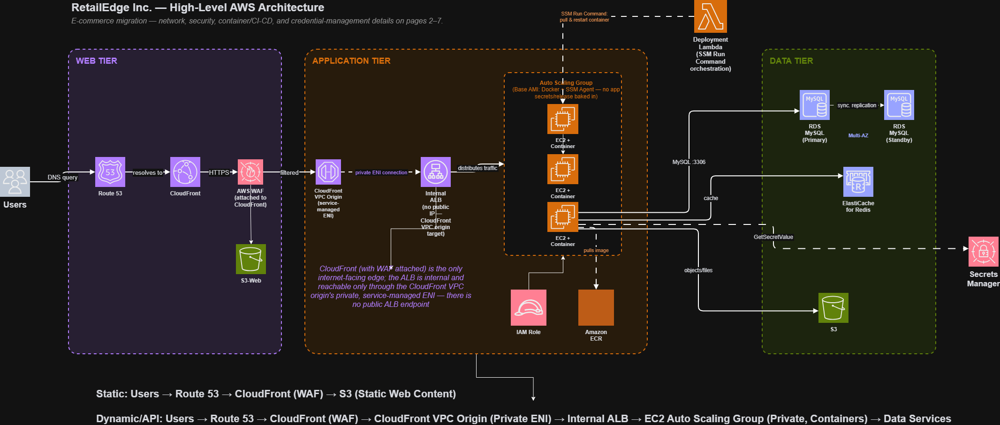

# AWS Three-Tier Web Architecture Workshop

## Description

This workshop is a hands-on walkthrough of a three-tier web architecture in AWS. It covers manual creation and configuration of the networking, security, application, and database components required to operate the architecture in a highly available and scalable manner.
## Related Repositories

The AWS infrastructure for the RetailEdge application is maintained in a separate repository:

**Infrastructure Repository:** [RetailEdge AWS Infrastructure](https://github.com/aliaagamall/retail-edge-aws)

## Audience

Although this is an introductory-level workshop, it is intended for people with a technical background. The workshop assumes foundational AWS knowledge, including VPC, EC2, RDS, S3, Elastic Load Balancing, and the AWS Management Console.

## Prerequisites

1. An AWS account. If you do not have one, visit the [AWS Console](https://aws.amazon.com/console/) and select **Create an AWS Account**.
2. An IDE or text editor of your choice.
3. Basic familiarity with Git and GitHub.

## Architecture Overview



The RetailEdge application follows a scalable three-tier architecture on AWS. The web and application tiers are separated, while the data tier is protected inside private subnets.

The web tier consists of a React.js frontend hosted in an Amazon S3 bucket and delivered through Amazon CloudFront. CloudFront also provides the API entry point and routes API requests to the application tier through a VPC Origin.

The application tier runs the Node.js application on Amazon EC2 instances managed by an Auto Scaling Group. Traffic passes through an internal Application Load Balancer, which distributes requests across healthy EC2 instances. The application instances are deployed in private subnets and can scale horizontally based on workload.

The data tier uses Amazon RDS for MySQL and Amazon ElastiCache for Redis. RDS provides the persistent relational database, while Redis caches frequently accessed data to reduce database load and improve application performance. Both services are deployed inside the private network and are accessible only from the application tier.

AWS controls are applied between each layer through security groups, IAM roles, AWS Secrets Manager, and private networking. Database and Redis credentials are retrieved at runtime from AWS Secrets Manager rather than stored directly in application configuration.

```text
Users → CloudFront → S3 (Web) / VPC Origin → Internal ALB → EC2 Auto Scaling Group (App) → RDS MySQL / ElastiCache Redis
```

---

## RetailEdge Modifications

This repository is a fork of the original AWS Three-Tier Web Architecture Workshop, extended to support RetailEdge application requirements.

The current application-level changes are implemented in the following feature branch:

```text
feat/retailedge-aws-integration
```

## Application Tier Changes

### 1. Runtime Secrets Management

Database and Redis credentials are no longer stored directly in the application configuration. The application retrieves the required secrets from AWS Secrets Manager during startup. This keeps sensitive credentials outside the source code and enables independent secret management.

### 2. Redis Caching

Amazon ElastiCache for Redis was added as a caching layer for the application tier. The application can cache frequently accessed data, reducing unnecessary MySQL requests and improving performance.

### 3. Environment-Based Configuration

Application configuration is supplied through environment variables rather than hard-coded values. Sensitive database and Redis credentials are retrieved from AWS Secrets Manager at runtime, while non-sensitive configuration can be supplied through the application environment.

---

## Web Tier Changes

The original architecture used EC2 instances in the web tier to serve the React application. RetailEdge moves the static frontend to Amazon S3 and uses Amazon CloudFront as the public entry point.

### Frontend Request Flow

```text
User
  ↓
CloudFront
  ↓
S3
  ↓
React.js Application
```

CloudFront uses Origin Access Control (OAC) to securely access the S3 bucket without exposing the bucket publicly.

### API Request Flow

API requests are routed separately through CloudFront to the application tier.

```text
User
  ↓
CloudFront
  ↓
VPC Origin
  ↓
Internal ALB
  ↓
EC2 Auto Scaling Group
  ↓
Node.js Application
```

---

## Application Infrastructure Changes

The application tier runs on EC2 instances inside private subnets. An Application Load Balancer distributes incoming requests across healthy instances, while an Auto Scaling Group enables horizontal scaling based on demand.

The application infrastructure includes:

- Internal Application Load Balancer
- EC2 Auto Scaling Group
- EC2 Launch Template
- Private application subnets
- Target Group and health checks
- IAM Instance Profile
- AWS Systems Manager access
- Amazon ECR for application container images

---

## Data Tier Changes

The data tier uses Amazon RDS for MySQL as the primary relational database and Amazon ElastiCache for Redis as a cache for frequently accessed application data. The application tier is the only tier allowed to communicate with the data tier.

```text
EC2 App Tier
     │
     ├──→ RDS MySQL
     │
     └──→ ElastiCache Redis
```

Database access is restricted through security groups, and database credentials are managed through AWS Secrets Manager.

---

## Security

The architecture uses multiple layers of AWS security controls.

### Network Security

The VPC is divided into public and private subnets across multiple Availability Zones. Application and database resources are deployed in private subnets wherever possible, and security groups restrict traffic between the tiers.

```text
CloudFront
    ↓
Internal ALB
    ↓
Application EC2
    ↓
RDS / Redis
```

The application security group accepts application traffic only from the internal ALB security group. The database security group allows MySQL traffic only from the application security group. Redis traffic is similarly restricted to the application tier.

### Identity and Access Management

EC2 instances use IAM roles instead of storing AWS credentials locally. Application instances are granted permissions to:

- Retrieve application secrets from AWS Secrets Manager
- Pull container images from Amazon ECR
- Connect to AWS Systems Manager

### Secrets Management

Sensitive credentials are stored in AWS Secrets Manager. The application retrieves secrets at runtime instead of storing database or Redis credentials in source code or static configuration files.

---

## Deployment Architecture

The application is containerized, and its container image is stored in Amazon ECR. EC2 instances pull the required image and run the Node.js application.

```text
Developer
   ↓
GitHub
   ↓
CI/CD Pipeline
   ↓
Build & Test
   ↓
Amazon ECR
   ↓
EC2 Auto Scaling Group
   ↓
Node.js Application
```

The web frontend is built separately and deployed to the S3 web bucket, where it is served through CloudFront.

---

## Scalability and Availability

The application tier scales horizontally through an EC2 Auto Scaling Group. Multiple EC2 instances run across Availability Zones behind the internal Application Load Balancer. The group can launch additional instances as demand grows and terminate instances as demand decreases.

The database layer uses Amazon RDS with Multi-AZ deployment for improved availability. Amazon ElastiCache for Redis reduces pressure on the relational database, and CloudFront provides a globally distributed entry point for frontend and API traffic.

---

## Repository Structure

The repository contains the original workshop components together with RetailEdge-specific infrastructure and application changes.

```text
application-code/
├── web-tier/
└── app-tier/

modules/
├── networking/
├── security-groups/
├── vpc-endpoints/
├── iam/
├── alb/
├── rds/
├── elasticache/
├── ecr/
└── s3/

.github/
└── workflows/
```

## Feature Branch

The current application-level changes are implemented in:

```text
feat/redis-cache-and-runtime-secrets
```

This branch contains the Redis caching and runtime secrets management changes before they are merged into the main branch.
